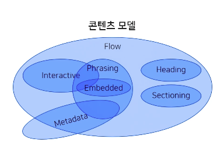

# 3. 콘텐츠모델, 시맨틱마크업, 블록 & 인라인

- [3. 콘텐츠모델, 시맨틱마크업, 블록 & 인라인](#3-콘텐츠모델-시맨틱마크업-블록--인라인)
  - [1) 콘텐츠 모델](#1-콘텐츠-모델)
    - [Content Model: 7 Categories](#content-model-7-categories)
    - [METADATA](#metadata)
    - [FLOW](#flow)
    - [SECTIONING](#sectioning)
    - [HEADING](#heading)
    - [PHRASING](#phrasing)
    - [EMBEDDED](#embedded)
    - [INTERACTIVE](#interactive)
  - [2) 시멘틱 마크업](#2-시멘틱-마크업)
  - [3) HTML5 시멘틱 요소](#3-html5-시멘틱-요소)
  - [4) 블록 & 인라인](#4-블록--인라인)
    - [Block & Inline](#block--inline)

## 1) 콘텐츠 모델

- HTML 요소들의 성격에 따라 그룹화 한것을 콘텐츠 모델이라 함

### Content Model: 7 Categories



- Metadata
- Flow
- Sectioning
- Heading
- Phrasing
- Embedded
- Interactive

### METADATA

- style, script 를 설정하거나 다른 문서와의 관계 등의 정보를 포함하는 요소
- head 태그내에 들어감

### FLOW

- 문서에 사용되는 대부분의 요소
- 문서에 의해 자연스럽게 흘러가며 배치되는 태그들
- 일부 메타 태그들만 빠짐

### SECTIONING

- 문서의 구조와 관련된 것들
- article, aside, nav, section
- 아웃라인과 연관

### HEADING

- 섹션의 헤더를 정의
- h1 ~ h6

### PHRASING

- 문서의 텍스트이며 문단 내부 레벨로 마크업 하는 요소

### EMBEDDED

- 외부 컨텐츠를 문서내에 표현하는 요소
- 미디어 관련 태그, iframe 등이 있음

### INTERACTIVE

- 사용자와 상호작용을 하는 요소
- 대표 form

## 2) 시멘틱 마크업

- Semantic Markup
  - Sematic: 의미론적인
- 컴퓨터(브라우저)가 잘 이해할 수 있는 코드

```html
<b>굵은</b> vs <strong>중요한</strong>
<i>기울어진</i> vs <em>강조하는</em>
<u>밑줄친</u> vs <ins>새롭게 추가된</ins>
<s>중간선이 있는</s> vs <del>삭제된</del>
```

> 똑같이 표현되지만 의미는 같지 않으니 잘 염두해서 사용하시길..

- 의미에 맞는 요소 사용
- 문서의 구조화
- 인간과 기계가 모두 이해할 수 있는 것이 목표

## 3) HTML5 시멘틱 요소

> [MDN web docs: Semantics](https://developer.mozilla.org/en-US/docs/Glossary/Semantics) 요약정리, 예시는 직접들어가서 보길 권장

- article
  - page, application, site 와 같이 페이지 내에 단독적인 의미를 가지는 것
  - 독립적이고 재사용가능성에 초점이 있음
- aside
  - 메인컨텐츠와 관련없는 부차적 컨텐츠
  - sidebar, call-out box 등에 주로 사용
- figure
  - 컨텐츠에 캡션을 달아야 할 경우 크게 윤곽잡는 용도
- figcaption
  - figure 요소 컨텐츠의 부차 설명(캡션)에 사용
  - 이미지 부차설명, 비디오 부차설명 등이 있음
- details
  - 클릭해야 볼 수 있는 컨텐츠에 사용
- summary
  - details의 문구
- footer
  - 어떤 섹션의 하단 영역으로 사용
  - 주로 작가, 회사명 등에 사용
- header
  - 말그대로 컨텐츠의 헤더
- main
  - body 영역의 제일 중요한 컨텐츠를 말함
- mark
  - Mark Text element
  - 컨텐츠 텍스트 중 중요한 영역
  - hilighted 해줌
- nav
  - Navication Section
  - 현재 문서의 위치를 나타내 줌
  - ex. Bikes > BMX > Jump Bike 3000
- section
  - a standalone section
  - 그 이상의 의미 없음
- time
  - 말그대로의 시간표현 텍스트
  - datetime 속성으로 machine-readable 하게 사용할 수 있음
  - 글 작성 시간 등 활용에 용이
  
## 4) 블록 & 인라인

> 콘텐츠모델 7 가지를 이전에 분류 해보았지만, 사실 그 이전엔 블록/인라인 태그들로 분류를 많이 함 => 지금도 많이함 (시각적 구분이 뚜렷)

### Block & Inline

- block level 요소
  - 한 줄에 하나
  - 부모 요소의 width를 가득 채움 
  - box
  - div, h1-h6, p, ul, li, table 등
- inline level 요소
  - 한줄에 여러개 가능
  - 내용 만큼만 자치
  - span, i, img, em, strong 등
- inline 안에 block 레벨은 불가!
  - 예외! a 는 block 요소를 자식으로 가질 수 있음
